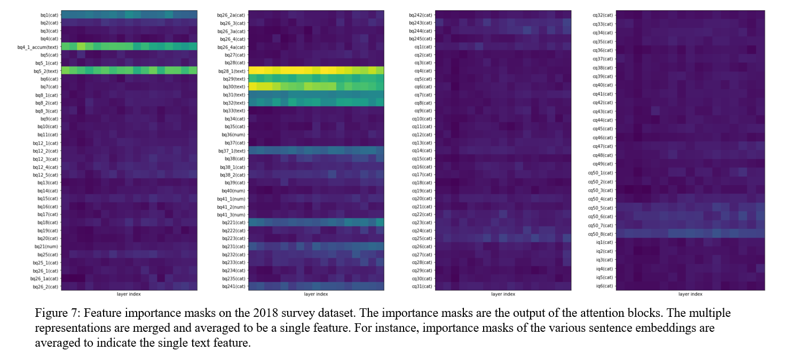

# SiD - Simple Deep Model
**Vectorwise Interpretable Attentions for Multimodal Tabular Data**

## Winning Solution for a Competition
This repository is an official implementation of a model which won first place in [the dacon competition](https://dacon.io/competitions/official/235865/talkboard). You can see the final result on [this post](https://dacon.io/competitions/official/235865/talkboard/405999?page=1&dtype=recent). If you want to reproduce the score of the competition, please check out [this documentation](./REPRODUCTION.md) which is used to verify by the competition hosts.

## Introduction
SiD is a vectorwise interpretable attention model for multimodal tabular data. It is designed and considered to handle data as vectors so that multimodal data (e.g. text, image and audio) can be encoded into the vectors and used with the the tabular data.

## Requirements
The requirements of this project is as follows:

- numpy
- omegaconf
- pandas
- pytorch_lightning
- scikit_learn
- torch==1.10.1
- transformers
- wandb

Instead, you can simply install the libraries at once:
```bash
$ pip install -r requirements.txt
```

## Architecture

| Model Architecture | Residual Block |
|:-:|:-
:|
|  |  |

As mentioned above, SiD is considered to extend [TabNet](https://arxiv.org/abs/1908.07442) with vectorwise approach. Because many multimodal data (e.g. text, image and audio) are encoded into the vectors, it is important to merge the tabular data with the vectors. However, the attention mechanism (attentive transformer) of TabNet does not consider the vectorized features. Therefore we propose the vectorwise interpretable attention model.

## Experiments

| **Hyperparameter Settings** |  |
|:-:|:-:|
| **Experimental Results** |  |
| **Ablation Studies** |  |

## Interpretability

| Year | Importance Mask | Year | Importance Mask |
|:-:|:-:|:-:|:-:|
| **2017** |  | **2018** |  |
| **2019** |  | **2020** |  |

| **Importance Mask** |  |
|:-:|:-:|
| **Question Dialogs** |  |

## License
This repository is released under the Apache License 2.0. License can be found in [LICENSE file](./LICENSE).